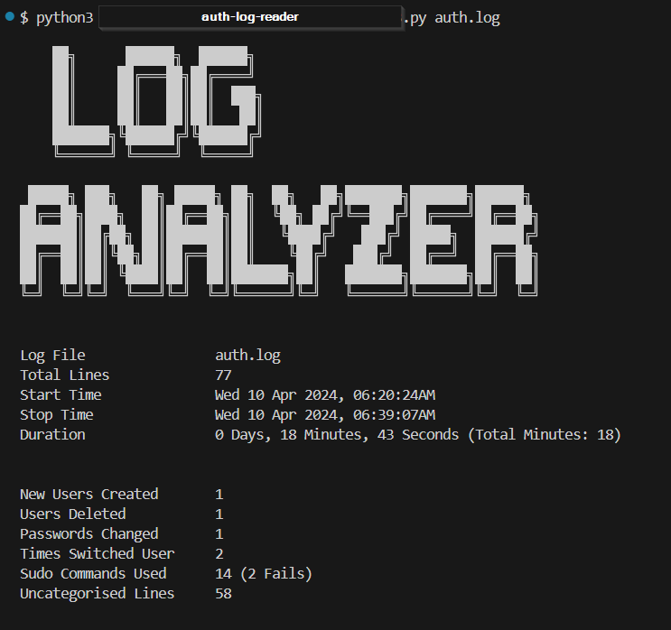
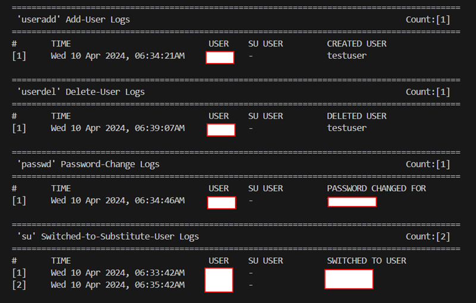
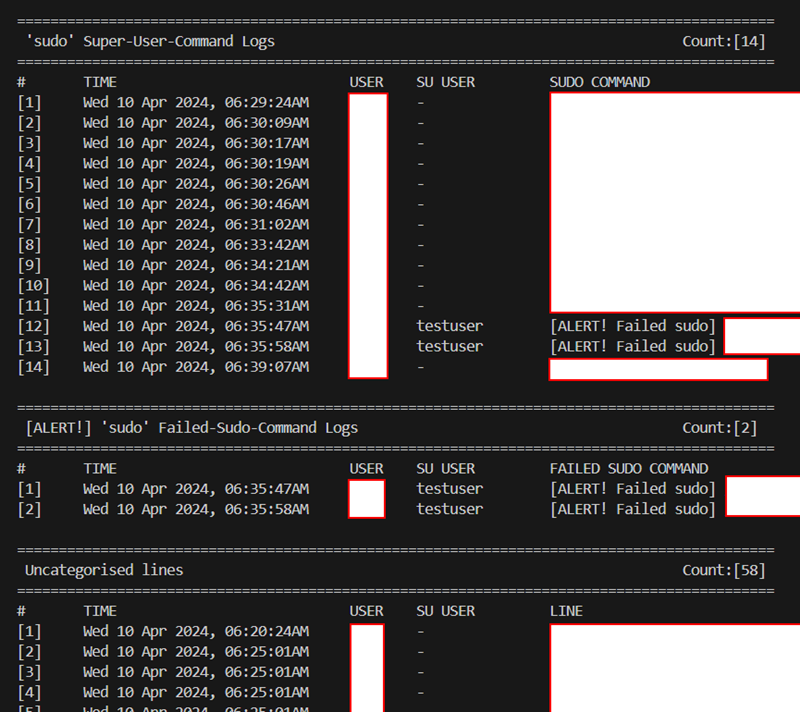

# AuthLogReader 
A Python CLI script for linux to automate reading and sorting auth.log into readable data.  
Tested in Kali Linux.  

## How to Use  
format:	`python3 <thisfilename>.py <authlogfilename>.log`  
example 1:	`python3 auth-log-reader.py auth.log`  
example 2:	`python3 auth-log-reader.py /var/log/auth.log`  
  
## Contents  
1. Log Parse auth.log: Extract command usage.   
1.1. Include the Timestamp (converted to readable format)   
1.2. Include the executing user.   
1.3. Include the command used.   
  
2. Log Parse auth.log: Monitor user authentication changes.   
2.1. Print details of newly added users.   
2.2. Print details of deleted users.   
2.3. Print details of changing passwords.   
2.4. Print details of when users used the su command.  
2.5. Print details of users who used the sudo; include the command.  
2.6. Print ALERT! If users failed to use the sudo command; include the command.  
   
## Sample Output  
  
  
  
